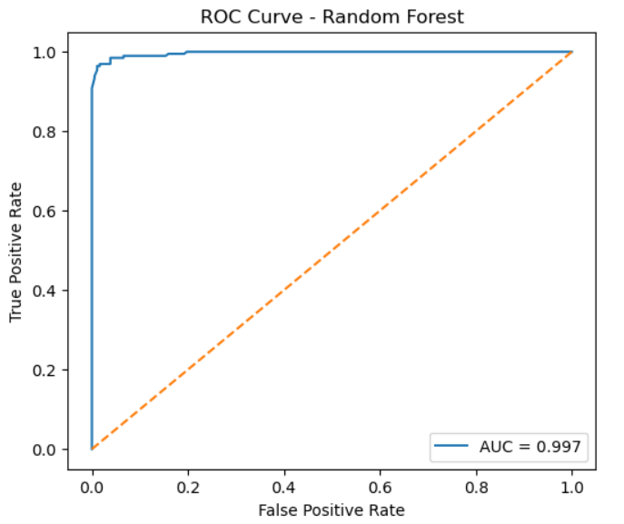
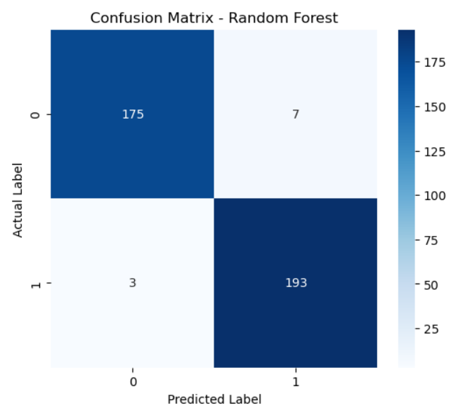

# Heart Disease Detection using Machine Learning

This project predicts the likelihood of heart disease using machine learning techniques on clinical patient data.  
Multiple classification models were implemented and compared, with Random Forest achieving the best performance for accurate heart disease detection.

## Dataset
- Heart Disease Dataset (CSV)
- 1888 patient records with clinical features
- Target: `0` = No Heart Disease, `1` = Heart Disease

## Feature Description

The dataset contains 14 clinical attributes commonly used in cardiovascular diagnosis:

- **Age** — Age of the patient (years)
- **Sex** — Gender (1 = Male, 0 = Female)
- **ChestPainType (cp)** — Type of chest pain (4 categories)
- **RestingBP (trestbps)** — Resting blood pressure (mm Hg)
- **Cholesterol (chol)** — Serum cholesterol level (mg/dl)
- **FastingBS (fbs)** — Fasting blood sugar > 120 mg/dl (1 = True, 0 = False)
- **RestingECG (restecg)** — Resting electrocardiographic results
- **MaxHR (thalachh)** — Maximum heart rate achieved
- **ExerciseAngina (exang)** — Exercise-induced angina (1 = Yes, 0 = No)
- **Oldpeak (oldpeak)** — ST depression induced by exercise
- **ST_Slope (slope)** — Slope of peak exercise ST segment
- **NumMajorVessels (ca)** — Number of major vessels colored by fluoroscopy
- **Thalassemia (thal)** — Thalassemia status (normal/fixed/reversible defect)

**Target Variable:**
- **HeartDisease (target)** — Presence of heart disease (1 = Disease, 0 = No Disease)


## Models
- Logistic Regression (Baseline Model)
- Random Forest (Final Selected Model)
- Support Vector Machine (SVM)
- K-Nearest Neighbors (KNN)

## Results

Multiple machine learning models were evaluated on the dataset.  
Random Forest achieved the best performance among all models.

| Model | Test Accuracy | Precision | Recall | F1 Score |
|------|--------------|----------|--------|---------|
| Logistic Regression | 0.738 | 0.712 | 0.832 | 0.767 |
| Random Forest | **0.974** | **0.965** | **0.985** | **0.975** |
| SVM | 0.627 | 0.614 | 0.755 | 0.677 |
| KNN | 0.796 | 0.790 | 0.827 | 0.808 |

Random Forest was selected as the final model due to its superior accuracy and recall in detecting heart disease.

## Model Performance Visualization

### ROC Curve (Random Forest)

The ROC curve demonstrates excellent class separation with an AUC of 0.997, indicating strong discriminative capability between heart disease and non-disease cases.



### Confusion Matrix (Random Forest)

The confusion matrix shows very low false positives and false negatives, confirming the model’s reliability for heart disease detection.



## Technologies
- Python
- NumPy, Pandas
- Matplotlib, Seaborn
- Scikit-learn

## How to Run

### 1. Clone the Repository
```bash
git clone https://github.com/aryan-pandey00/Heart-Disease-Detection.git
cd Heart-Disease-Detection
```
### 2.Install Dependencies
```bash
pip install -r requirements.txt
```
### 3.Run the Project
- Open the Jupyter Notebook
- Ensure heart_dataset.csv path is correct
- Run all cells
